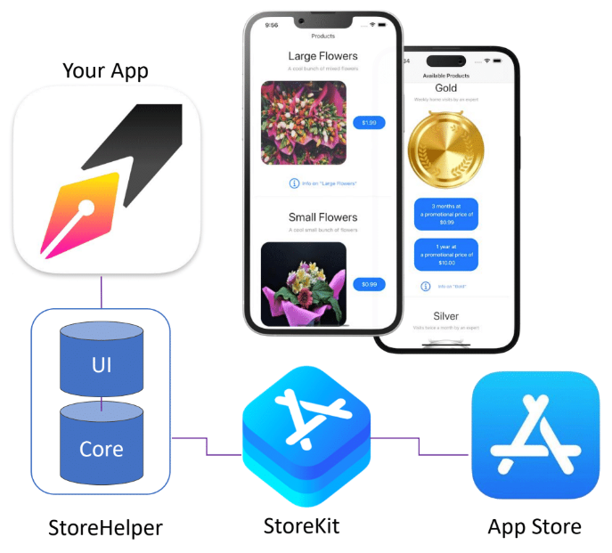

#  StoreHelperDemo

Implementing and testing in-app purchases with `StoreKit2` and `StoreHelper` in **Xcode 13 - 15** with **SwiftUI**, **Swift 5.7 - 5.9**, **iOS 15 - 17** and **macOS 12 - 14**.

---

# Description

- [StoreHelper Documentation Landing Page](https://russell-archer.github.io/StoreHelper/documentation/storehelper/) - `StoreHelper` documentation landing page
- [StoreHelper Quick Start](https://russell-archer.github.io/StoreHelper/documentation/storehelper/quickstart) - `StoreHelper` quick-start guide 
- [StoreHelper In-Depth Guide](https://russell-archer.github.io/StoreHelper/documentation/storehelper/guide) - `StoreHelper` and `StoreKit2` in-depth guide
- [StoreHelper Demo with UIKit](https://github.com/russell-archer/StoreHelperDemoUIKit) - experimental demo showing `StoreHelper` in a UIKit project

# Recent Changes

## 13 Feb 2024
- Updated demo project minimum iOS target to iOS 17.0 and macOS to 14.0
- Added views to show how to integrate StoreKit's `StoreView`, `ProductView`, and `SubscriptionStoreView`
- Replaced deprecated `NavigationView` with `NavigationStack` in `MainView`
